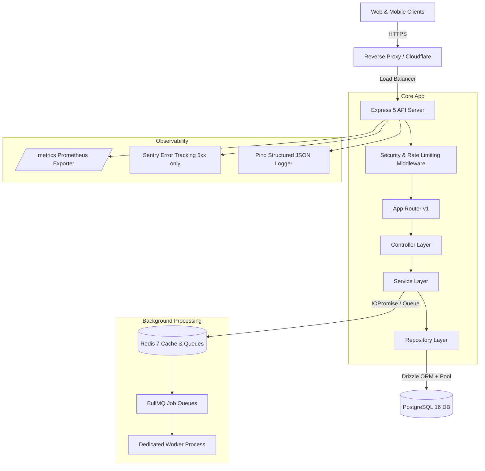

# Learning Matters Backend Server

> Production-grade REST API backend service for the Learning Matters educational platform, engineered with Express 5, TypeScript (strict mode), PostgreSQL (Drizzle ORM), Redis, and BullMQ.

[](https://github.com/learning-matters/server/actions/workflows/ci.yml)
[](https://nodejs.org/)
[](LICENSE)

---

## Table of Contents

- [Overview & Architecture](#overview--architecture)
- [Tech Stack](#tech-stack)
- [Project Structure](#project-structure)
- [Quick Start](#quick-start)
  - [Prerequisites](#prerequisites)
  - [Local Development Setup](#local-development-setup)
  - [Docker Compose Quick Start](#docker-compose-quick-start)
- [Environment Variables](#environment-variables)
- [Available Scripts](#available-scripts)
- [API Overview & Documentation](#api-overview--documentation)
- [Database & Migrations](#database--migrations)
- [Background Jobs & Workers](#background-jobs--workers)
- [Observability & Health Checks](#observability--health-checks)
- [Testing](#testing)
- [Deployment Guide](#deployment-guide)
- [Troubleshooting](#troubleshooting)

---

## Overview & Architecture

Learning Matters Server is built following strict production standards, ensuring zero-downtime rolling deploys, end-to-end type safety, resilient database pooling, and defense-in-depth security.



---

## Tech Stack

| Component               | Technology               | Description                                              |
| ----------------------- | ------------------------ | -------------------------------------------------------- |
| **Runtime**             | Node.js 22 LTS           | Fast, modern JavaScript runtime with native ESM          |
| **Language**            | TypeScript 5 (Strict)    | `noUncheckedIndexedAccess`, `exactOptionalPropertyTypes` |
| **Framework**           | Express 5.2              | Modern asynchronous route error forwarding               |
| **Database**            | PostgreSQL 16            | Relational store with ACID transactions                  |
| **ORM / Query Builder** | Drizzle ORM              | Type-safe SQL schema definitions and migrations          |
| **Cache & Queues**      | Redis 7 + BullMQ         | Distributed rate limiting and resilient worker queues    |
| **Security**            | Helmet, CORS, HPP        | Strict HTTP headers, parameter pollution prevention      |
| **Auth**                | Argon2id + JWT           | Rotating opaque refresh tokens with reuse detection      |
| **Validation**          | Zod 3                    | Type inference and runtime input sanitization            |
| **Docs**                | OpenAPI 3.0 + Swagger UI | Generated automatically from Zod schemas                 |
| **Metrics & Errors**    | Prom-client + Sentry     | Route-normalized histograms and scrubbed error captures  |
| **Testing**             | Vitest + Testcontainers  | Real PostgreSQL container testing with 80%+ coverage     |

---

## Project Structure

```
server/
├── .github/                 # GitHub Actions workflows & Dependabot
├── drizzle/                 # Generated SQL migrations
├── src/
│   ├── config/              # Validated environment schemas & constants
│   ├── db/                  # Connection pool, transactions, and Drizzle schemas
│   │   └── schema/          # Table definitions (users, refresh_tokens)
│   ├── docs/                # OpenAPI specification generator & Swagger UI
│   ├── jobs/                # BullMQ queues, job workers, and email worker
│   ├── lib/                 # Shared utilities (logger, metrics, redis, sentry)
│   ├── middleware/          # Express middlewares (security, auth, rate limit)
│   ├── modules/             # Modular feature domains
│   │   ├── auth/            # Authentication, token rotation, sessions
│   │   ├── health/          # Kubernetes /health and /ready probes
│   │   ├── metrics/         # Prometheus /metrics endpoint
│   │   └── users/           # User management, CRUD, pagination
│   ├── server.ts            # API HTTP server entrypoint
│   └── worker.ts            # Background job consumer entrypoint
├── tests/
│   └── integration/         # Supertest integration tests with Testcontainers
├── Dockerfile               # Multi-stage production container build
├── docker-compose.yml       # Local development stack
└── vitest.config.ts         # Vitest test runner configuration
```

---

## Quick Start

### Prerequisites

- **Node.js**: `>=22.0.0`
- **npm**: `>=10.0.0`
- **Docker & Docker Compose**: (for running PostgreSQL and Redis)

### Local Development Setup

1. **Clone the repository and install dependencies:**

   ```bash
   git clone https://github.com/learning-matters/server.git
   cd server
   npm ci
   ```

2. **Configure environment variables:**

   ```bash
   cp .env.example .env
   # Customize passwords and JWT secrets in .env
   ```

3. **Start local infrastructure (PostgreSQL & Redis):**

   ```bash
   docker compose up -d postgres redis
   ```

4. **Run database migrations:**

   ```bash
   npm run db:migrate
   ```

5. **Start API server and background worker in watch mode:**
   ```bash
   # Terminal 1: API Server
   npm run dev

   # Terminal 2: Worker Process
   npm run worker:dev
   ```

The API will be available at `http://localhost:3000`.

### Docker Compose Quick Start

To spin up the entire production-like stack (Postgres, Redis, Migration runner, API, and Worker) with a single command:

```bash
npm run docker:up
```

Verify service readiness:

```bash
curl http://localhost:3000/ready
```

Stop the stack:

```bash
npm run docker:down
```

---

## Environment Variables

All environment variables are validated at startup with Zod. Missing or malformed variables halt the process immediately.

| Variable               | Type   | Default                  | Description                                             |
| ---------------------- | ------ | ------------------------ | ------------------------------------------------------- |
| `NODE_ENV`             | Enum   | `development`            | `development`, `test`, or `production`                  |
| `PORT`                 | Number | `3000`                   | Port for the HTTP server                                |
| `DATABASE_URL`         | String | -                        | PostgreSQL connection URI                               |
| `DB_POOL_MIN`          | Number | `2`                      | Minimum connection pool size                            |
| `DB_POOL_MAX`          | Number | `10`                     | Maximum connection pool size                            |
| `REDIS_URL`            | String | `redis://localhost:6379` | Redis connection URI                                    |
| `JWT_ACCESS_SECRET`    | String | -                        | Secret for signing short-lived access JWTs (>=32 chars) |
| `JWT_REFRESH_SECRET`   | String | -                        | Secret for rotating refresh tokens (>=32 chars)         |
| `JWT_ACCESS_TTL`       | String | `15m`                    | Access token lifespan (`15m`, `1h`)                     |
| `JWT_REFRESH_TTL`      | String | `7d`                     | Refresh token lifespan (`7d`, `30d`)                    |
| `CORS_ORIGIN`          | String | `http://localhost:3000`  | Comma-separated list of allowed origins                 |
| `RATE_LIMIT_MAX`       | Number | `100`                    | Max requests per rate limit window                      |
| `RATE_LIMIT_WINDOW_MS` | Number | `60000`                  | Rate limit window in milliseconds (1 min)               |
| `METRICS_TOKEN`        | String | -                        | Optional bearer token to protect `/metrics`             |
| `SENTRY_DSN`           | String | -                        | Optional Sentry DSN for 5xx exception tracking          |
| `LOG_LEVEL`            | Enum   | `info`                   | `trace`, `debug`, `info`, `warn`, `error`, `fatal`      |

---

## Available Scripts

| Script                     | Command                            | Description                           |
| -------------------------- | ---------------------------------- | ------------------------------------- |
| `npm run dev`              | `tsx watch src/server.ts`          | Start API server in watch mode        |
| `npm run build`            | `tsup`                             | Compile production bundle to `dist/`  |
| `npm start`                | `node dist/server.js`              | Run compiled production server        |
| `npm run typecheck`        | `tsc --noEmit`                     | Strict TypeScript compiler validation |
| `npm run lint`             | `eslint src --ext .ts`             | Lint TypeScript source files          |
| `npm run format:check`     | `prettier --check`                 | Verify formatting across files        |
| `npm run format`           | `prettier --write`                 | Auto-format files with Prettier       |
| `npm test`                 | `vitest run`                       | Execute unit and integration tests    |
| `npm run test:unit`        | `vitest run --project unit`        | Fast unit test suite                  |
| `npm run test:integration` | `vitest run --project integration` | Integration test suite                |
| `npm run test:coverage`    | `vitest run --coverage`            | Generate v8 coverage report           |
| `npm run db:migrate`       | `tsx src/db/migrate.ts`            | Execute pending database migrations   |
| `npm run db:generate`      | `drizzle-kit generate`             | Generate SQL migration from schema    |
| `npm run docs:generate`    | `tsx src/docs/generate.ts`         | Re-generate `openapi.json`            |
| `npm run docker:up`        | `docker compose up -d`             | Launch local Docker Compose stack     |
| `npm run docker:down`      | `docker compose down`              | Tear down Docker Compose stack        |

---

## API Overview & Documentation

Interactive Swagger documentation is available in non-production environments at:

- **Swagger UI:** `http://localhost:3000/api/docs`
- **OpenAPI 3.0 Spec:** `http://localhost:3000/api/v1/openapi.json`

### Core Endpoints

- **Authentication (`/api/v1/auth`)**
  - `POST /register`: Create a new user account with hashed password.
  - `POST /login`: Authenticate credentials, return access token and refresh token.
  - `POST /refresh`: Rotate refresh token with reuse detection.
  - `POST /logout`: Revoke single refresh session.
  - `POST /logout-all`: Revoke all sessions across all devices for user.
- **User Management (`/api/v1/users`)**
  - `GET /me`: Fetch authenticated user profile.
  - `GET /`: Cursor-paginated user directory (`admin` only).
  - `GET /:id`: Fetch user by ID (`admin` or account owner).
  - `PATCH /:id`: Update user role or active status (`admin` or owner).
  - `DELETE /:id`: Soft-delete user (`admin` only).
- **Probes & Operations**
  - `GET /health`: Liveness probe (HTTP server status and uptime).
  - `GET /ready`: Readiness probe (deep ping of PostgreSQL and Redis).
  - `GET /metrics`: Protected Prometheus metrics (scrape endpoint).

---

## Database & Migrations

All schema modifications are tracked via Drizzle ORM migrations in `drizzle/`.

1. **Modify Schema:** Edit definitions in `src/db/schema/`.
2. **Generate Migration:**
   ```bash
   npm run db:generate
   ```
3. **Review Migration:** Check the generated SQL in `drizzle/`.
4. **Apply Migrations:**
   ```bash
   npm run db:migrate
   ```

---

## Background Jobs & Workers

BullMQ is used for reliable background job processing backed by Redis.

- **Email Worker:** Asynchronously sends transaction notifications and welcome emails.
- **Concurrency & Failure:** Configured with exponential backoff retries and dead-letter monitoring.
- **Running Workers:** In production, run workers independently using `npm run worker`.

---

## Observability & Health Checks

- **Prometheus Metrics:** Request durations, error rates, and connection pool saturation are scraped via `GET /metrics`. Route labels use normalized patterns (`/api/v1/users/:id`) to prevent high-cardinality metric explosion.
- **Sentry Integration:** Captures unhandled 5xx exceptions. Headers and sensitive payload keys (`password`, `refreshToken`) are automatically scrubbed before transmission.
- **Structured Logging:** Fast JSON logs using Pino with automatic `x-request-id` correlation.

---

## Testing

The test suite is partitioned into unit tests and integration tests:

```bash
# Run all tests
npm test

# Run unit tests only
npm run test:unit

# Run integration tests (with Testcontainers or Docker fallback)
npm run test:integration

# Enforce coverage threshold (>80% required)
npm run test:coverage
```

---

## Troubleshooting

- **Redis Connection Failures:** Ensure Redis is running (`docker compose up -d redis`) or check `REDIS_URL` in `.env`.
- **Database Connection Refused:** Ensure PostgreSQL is running and credentials match in `.env`. Run `docker compose ps` to inspect container health.
- **Docker Permission Issues:** The production image runs as non-root `node` (UID 1000). Ensure mounted directories have appropriate read/write permissions.
