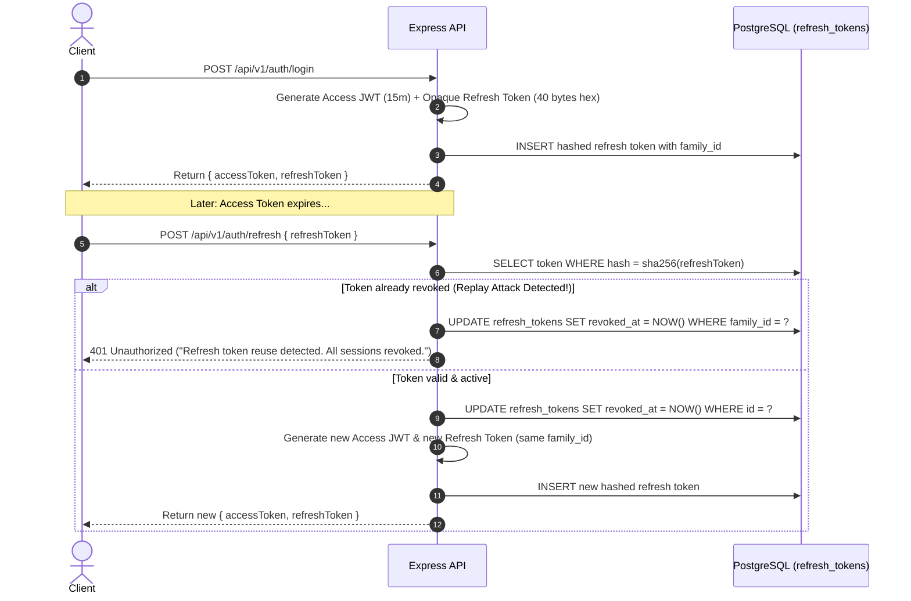

# Architecture Guide

This document describes the architectural principles, layering rules, request lifecycle, authentication mechanisms, and shutdown guarantees of the Learning Matters backend service.

---

## Layering Rules & Architectural Boundaries

The codebase follows a strict 4-layer clean architecture pattern. Dependencies must flow strictly inward:
**Routes → Controller → Service → Repository → Database**

```
┌────────────────────────────────────────────────────────┐
│                      HTTP Routes                       │
│    (URL patterns, security middleware, validation)     │
└──────────────────────────┬─────────────────────────────┘
                           │ calls
                           ▼
┌────────────────────────────────────────────────────────┐
│                   Controllers Layer                    │
│      (Extracts params/body, translates HTTP responses) │
└──────────────────────────┬─────────────────────────────┘
                           │ calls
                           ▼
┌────────────────────────────────────────────────────────┐
│                     Services Layer                     │
│    (Business logic, domain rules, transactions, auth)  │
└──────────────────────────┬─────────────────────────────┘
                           │ calls
                           ▼
┌────────────────────────────────────────────────────────┐
│                   Repositories Layer                   │
│   (SQL query construction, Drizzle ORM, DB schema)     │
└────────────────────────────────────────────────────────┘
```

### Layer Responsibilities

1. **Routes (`*.routes.ts`)**
   - Bind HTTP verbs and paths.
   - Attach middleware (authentication, authorization, rate limiting, validation).
   - **Never** contain business logic or raw database queries.

2. **Controllers (`*.controller.ts`)**
   - Extract typed data from `req.body`, `req.params`, and `req.query`.
   - Call appropriate Service methods.
   - Set HTTP status codes and return standardized JSON payloads.
   - Pass errors to Express `next(err)`.

3. **Services (`*.service.ts`)**
   - Implement business logic, authorization rules, and workflows.
   - Coordinate transactions across multiple repositories or queues.
   - Throw operational errors (`AppError` subclasses: `BadRequestError`, `NotFoundError`, etc.).
   - Completely decoupled from HTTP request/response objects.

4. **Repositories (`*.repository.ts`)**
   - Construct type-safe SQL queries using Drizzle ORM.
   - Strip sensitive attributes (e.g. `passwordHash`) by default before returning safe models.
   - Handle soft deletion filters (`deletedAt IS NULL`).

---

## Error Handling Model

All errors bubble up to the centralized Express `errorHandler` middleware.

```
       Uncaught Exception / Handled Error
                       │
                       ▼
            Is error an AppError?
              ├── Yes ──► Send structured JSON with error.statusCode & code
              │
              └── No  ──► Is Database/Zod error?
                            ├── Yes ──► Map to standard 400/409 AppError
                            │
                            └── No  ──► Treat as 500 INTERNAL_SERVER_ERROR
                                          ├── Log error with stack trace (Pino)
                                          ├── Report to Sentry (scrubbed headers)
                                          └── Return generic message to client
```

### Response Contract

Standardized JSON error shape:

```json
{
  "error": {
    "code": "VALIDATION_ERROR",
    "message": "Invalid user input",
    "details": {
      "email": ["Invalid email address"]
    }
  }
}
```

---

## Refresh Token Rotation & Session Security

To protect against token theft, refresh tokens use **cryptographic rotation** and **automatic reuse detection**.



---

## Graceful Shutdown Sequence

When a termination signal (`SIGTERM` or `SIGINT`) is received:

1. **Stop accepting new connections:** `server.close()` stops listening on the HTTP port.
2. **Finish active requests:** Existing in-flight HTTP requests are given up to 10 seconds to finish.
3. **Execute cleanup handlers:** Registered cleanup tasks are executed in order:
   - Worker queues are paused and completed (`emailQueue.close()`).
   - Redis connection pool is closed (`redis.quit()`).
   - PostgreSQL connection pool is drained (`pool.end()`).
4. **Exit cleanly:** Process terminates with code 0.
